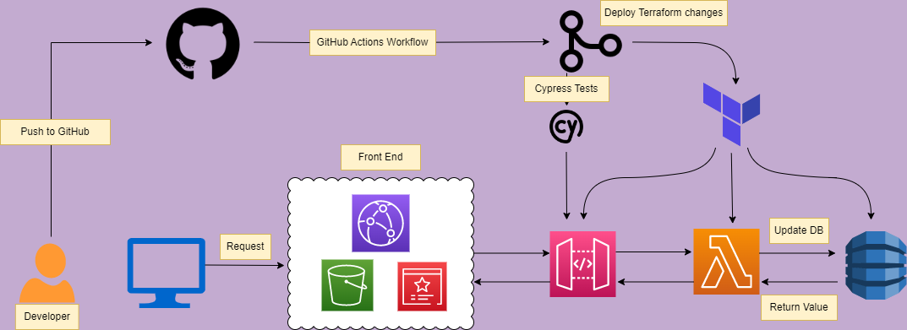

# **Cloud Resume Challenge**
I completed the [Cloud Resume Challenge](https://cloudresumechallenge.dev/docs/the-challenge/aws/), which is a full stack static website project which utilizes multiple AWS services.

My deployed resume website can be found [here](https://chasedecosterresume.com)

---

## FRONT-END DIAGRAM: 

The frontend portion of this project was built using AWS S3, which hosted my static website consisting of HTML, CSS, and JavaScript files. I purchased my domain name from AWS Route53, which pointed internet traffic to an AWS CloudFront distribution. Cloudfront would cache my files from S3, and serve my website content to users. AWS Certificate manager was also used to establish a TLS connection between the client, which provides a secure HTTPS connection. 

---

## CI/CD
GitHub actions was used to sync my S3 bucket when code was uploaded to my repository. After files are uploaded, Cloudfront cache provides real-time updates with any code/website changes.

---

## BACKEND DIAGRAM:

The backend portion was built using Terraform (IaC) to provision AWS DynamoDB, Lambda and API Gateway services. Once the website is visited, Javascript code runs to make an API call to AWS API Gateway; this call then triggers the Lambda function written in Python, to access AWS DyanmoDB, and retreive the current visitor count data. Every visit will add 1+ to the count attribute, and return the updated visitor count value whichs displays on webpage. 

---

## CI/CD
GitHub Actions were used to update the changes made in the Terraform configuration files any time code was pushed. Cypress tests were also run on the API Gateway to ensure the Lambda function returned usable data.